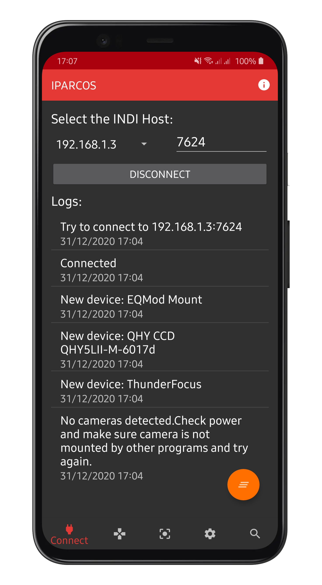
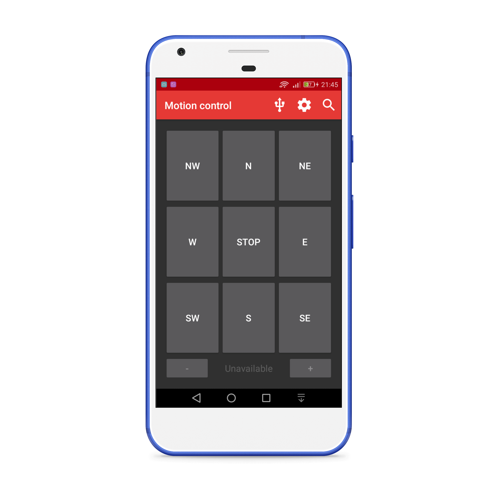
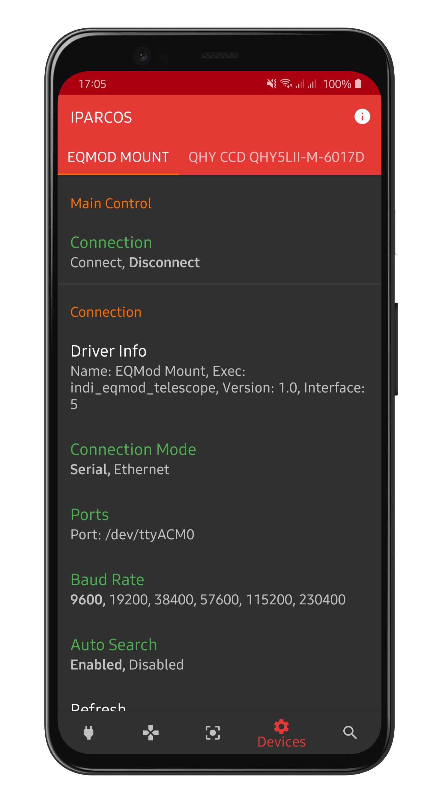

# IPARCOS

IPARCOS (Indi Protocol Android Remote COntrol Software) is an INDI client for Android.
It features an INDI control panel, a mount and focuser controller and a database of objects to point the telescope.

## Features

* Mount and focuser controller with directional pads and speed controls
* Database full of objects to which you can point the telescope directly from the app
* INDI control panel compatible with every device (BLOB properties not yet supported)
* Languages: English, Italian and French (partial translation)

### Screenshots

## Installing IPARCOS

- ~~From Google Play:~~
  - Coming soon!
- From the .apk file:
  - Allow apps from unknown sources in the Android settings (Settings → Security → Unknown sources)
  - Download and install the latest release from the GitHub project page

## Usage

1. Prerequisite
  - Minimum Android version: 5.0
  - An INDI server must be running on the remote computer.
  - You must have network access to the server. 
    - To achieve this, the Android device and the remote computer can be placed on your home network.
    - Alternatively, you can create a wireless network with your Android device and connect the remote computer to this network.
2. Connection:
  - Choose the server address in the list or press on "Add server" to add a new server in the list
  - Optionally, you can change the port number if you do not use the default value for the INDI protocol (7624)
  - Click on "Connect"
3. Use the INDI control panel
  - Click on the gear icon in the navigation bar to display the control panel
  - Use the tabs to switch between the devices
  - The properties of the device are displayed in a list. Click on a property to edit it or show the details.
4. Control the telescope motion
  - Press the joystick to display the telescope motion control panel
  - The buttons will be enabled or disabled depending on the devices features.
  - If the device is not connected, the properties may not appear and the buttons will be disabled
5. Focuser control
  - Supports speed control, focus in/out and absolute position

### Developed by

- **Marco Cipriani** (@marcocipriani01)
- **Romain Fafet** (@farom57)

### Used Libraries

- [INDIForJava](https://github.com/INDIForJava/INDIForJava), LGPL v3 license
- [DragListView](https://github.com/woxblom/DragListView), Apache 2.0 license
- [CWAC-Pager](https://github.com/commonsguy/cwac-pager), Apache 2.0 license